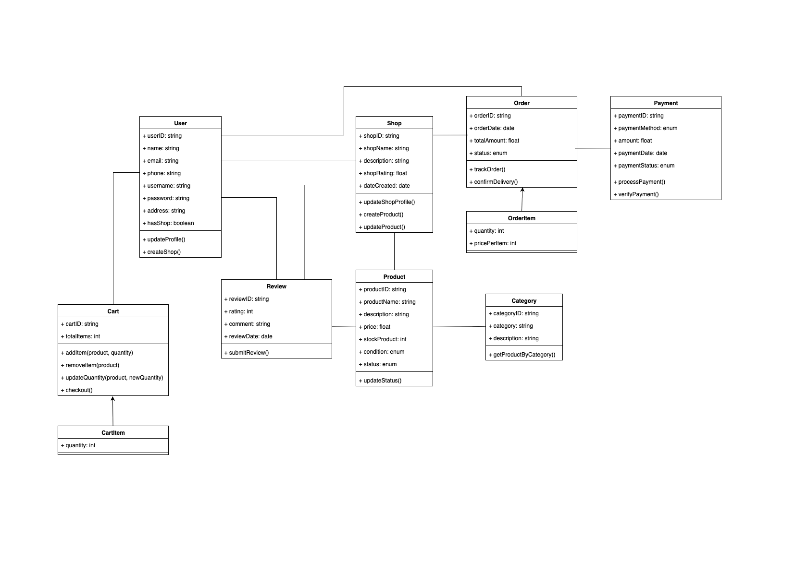
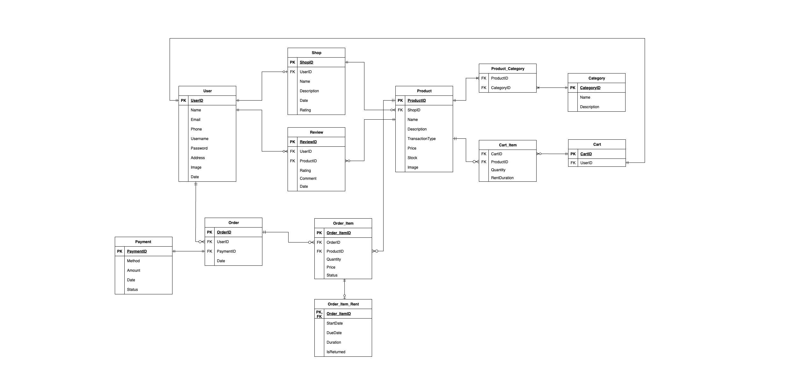

# BOZea: Sail More, Spend Less!

Peralatan kapal susah dicari? Cari yang pas dengan budget? Temukan semua perlengkapan laut di satu tempat denga harga terbaik. Selamat datang di BOZea!

## Cara Menjalankan Program (Bismillah bisa!)

```
dotnet restore
dotnet tool restore
dotnet clean
dotnet build
dotnet watch run
```

```
dotnet add package Microsoft.EntityFrameworkCore
dotnet add package Npgsql.EntityFrameworkCore.PostgreSQL
dotnet add package Microsoft.EntityFrameworkCore.Tools
dotnet add package Microsoft.EntityFrameworkCore.Design
dotnet add package DotNetEnv
dotnet tool install --global dotnet-ef
dotnet new tool-manifest
dotnet tool install dotnet-ef
dotnet build
dotnet ef migrations add InitialCreate
dotnet ef database update
dotnet watch run
```

```
dotnet ef migrations add NamaMigrationBaru
dotnet ef database update
```

## 👥 Developer

- 👑Ketua Kelompok : Olivia Nefri - 23/514860/TK/56532
- 🤵Anggota 1 : Bernards Widiyazulfathirrochim - 23/512647/TK/56341
- 👲Anggota 2 : Zaidan Harith - 23/512629/TK/56334

## 🌟 Apa itu BOZea?

BOZea adalah **platform digital khusus maritim** yang mempertemukan **nelayan, pemilik kapal, dan pelaku industri** untuk **jual-beli atau sewa peralatan laut bekas**.  
💡 Mulai dari **mesin kapal, alat navigasi (GPS, radar), alat tangkap ikan, suku cadang**, hingga perlengkapan pendukung lainnya.

## 🚩 Mengapa BOZea Hadir?

1. ⚓ **Akses sulit** – Peralatan maritim bekas tertentu susah ditemukan di pasar.
2. 💰 **Hemat biaya** – Beli/sewa barang bekas lebih efisien dibanding beli baru.
3. 🤝 **Kepercayaan transaksi** – Deskripsi & kontak jelas meningkatkan rasa aman.
4. 🌐 **Minim pasar khusus** – Belum ada platform yang fokus di bidang maritim.

## 🛠️ Solusi & Fitur Utama

✨ **Pencarian Pintar** – Filter jenis barang, merk, kondisi, harga.  
👤 **Profil Penjual & Pembeli** – Riwayat transaksi, rating, ulasan.  
📸 **Upload Produk** – Foto, deskripsi, harga, lokasi barang.  
💬 **Chat Langsung** – Komunikasi tanpa aplikasi tambahan.  
🤝 **Bargain Mode** – Tawar-menawar harga langsung di platform (via chat)  
🔔 **Notifikasi Real-time** – Update pesan, tawaran, dan produk baru.

> ⚠️ **Catatan:** Fitur akan berkembang sesuai dengan kemampuan tim 🚀

## 🔍 Referensi Aplikasi

Terinspirasi dari **Tokopedia, Shopee, dan TikTok Shop**,  
namun **BOZea fokus hanya pada pasar maritim** – Lebih spesifik, lebih relevan ⚓🌊

## 🎯 Visi BOZea

Membuat perdagangan maritim **lebih mudah, aman, dan hemat**,  
sehingga nelayan dan pelaku industri bisa **berlayar lebih jauh tanpa takut biaya tinggi**. 🚢✨

## 🤫 Class Diagram

Ikan hiu makan tomat, ini _class diagram_ nya sobat!!


## 📋 Entity-Relationship Diagram

Berikut ERD dari proyek BOZea ini!

